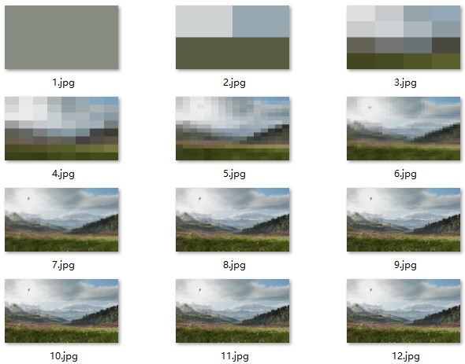

# Quadtree
Maybe it's easier to start at the quadtree, the [article]() will help you!

# Environment
- `Opencv 2.4.9` 
- `glm`

# result
A simple data struct in 2D.

And the different Depth of the quadtree:

